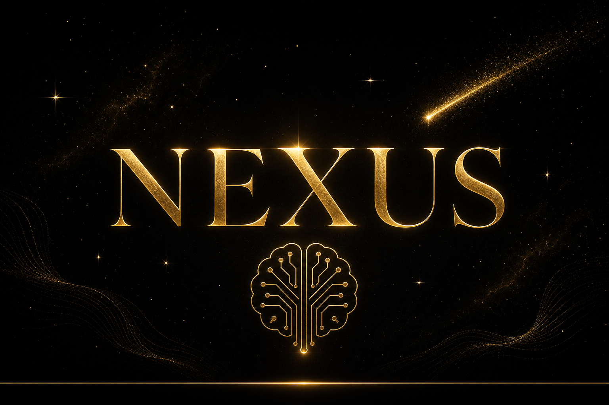

<div align="center">



# Nexus

**The open-source desktop AI agent platform for everyone.**

Build, customize, and deploy AI agents in under 2 minutes — no terminal required.

[](LICENSE)
[](https://tauri.app)
[](https://www.typescriptlang.org)
[](https://github.com/DucklingGod/nexus)

</div>

---

## What is Nexus?

Nexus is a **local-first desktop AI agent platform** built with Tauri 2 (Rust shell) and React (TypeScript). It gives non-technical users a working AI agent through a beautiful GUI — no CLI, no config files, no cloud dependency.

**Core principles:**
- **Local-first** — everything runs on your machine
- **Bring your own key** — you pay for your own API costs, zero hosting fees
- **Privacy by default** — API keys stored in your OS keychain, never in files
- **No always-on promise** — your data stays yours

## Quick Start

### 1. Download

Grab the latest release for your platform from [Releases](https://github.com/DucklingGod/nexus/releases).

### 2. Launch & Connect

Open Nexus → 3-click onboarding wizard:
1. Pick your AI provider (OpenAI, Anthropic, Google, OpenRouter, Ollama, and 7 more)
2. Paste your API key (encrypted in OS keychain)
3. Name your agent

### 3. Start Building

Your agent is ready. Ask it anything, upload documents for RAG, or build visual workflows.

## Features

### Chat & Intelligence
- **Streaming responses** with markdown rendering (code blocks, tables, lists)
- **Reasoning streaming** — see model thinking in real-time (OpenAI o1/o3, Claude extended thinking, DeepSeek R1)
- **12+ providers** — OpenAI, Anthropic, Google, OpenRouter, Ollama, and OpenAI-compatible endpoints
- **Smart model routing** — heuristic complexity classifier routes to the cheapest capable model
- **Semantic caching** — repeat queries answered instantly at $0 cost (cosine similarity ≥0.95)
- **Prompt caching** — Anthropic cache_control reduces costs ~90% on repeated system prompts
- **First-run onboarding** — agent introduces itself and gets to know new users naturally
- **Agent self-awareness** — agent knows it runs in Nexus, knows its tools and capabilities

### Tools & Capabilities
- **40+ built-in tools** — web search, file operations, terminal, code execution, search, patch, process management, todo lists
- **Tool approval system** — 4 safety modes: ask (confirm every change), auto (file edits automatic), plan (planning only), full (run everything)
- **Document RAG** — upload PDF, DOCX, XLSX, TXT, MD → extract, chunk, embed, and search with vector similarity
- **Multi-provider web search** — DuckDuckGo (free), Tavily, Brave, SearXNG

### Agent Builder
- **Visual agent customization** — name, role, personality, custom instructions
- **Capabilities toggle** — enable/disable tools per agent
- **60 built-in skills** across 8 categories (writing, research, productivity, coding, learning, life, business, creative)
- **Skill synthesizer** — agent learns new skills from tasks automatically (opt-in)
- **Semantic skill matching** — vector-based skill selection for better context

### Persistent Memory
- **5 context files** — rules, soul/persona, user profile, memory notes, current context
- **Auto-extract** — background LLM distills durable facts from conversations (default ON)
- **Cross-session persistence** — agent remembers user across restarts from day one
- **Transparent .md layer** — users can view/edit all memory in Settings → Context
- **remember tool** — agent proactively saves facts, preferences, and decisions

### Visual Workflows
- **Drag-and-drop canvas** — React Flow-based workflow builder
- **4 block types** — trigger, agent, tool, output
- **Execution engine** — topological sort, data flow between blocks, live status
- **Template library** — pre-built workflow templates

### Platform Connectors
- **Telegram** — long-poll mode, safe tools only, typing indicator
- **Discord** — Gateway WebSocket, safe tools only, typing indicator
- **Connector chats** — Telegram/Discord conversations appear in sidebar

### Desktop Experience
- **Tauri 2.x** — ~12MB (vs Electron's 200MB), native performance
- **Frameless window** with custom titlebar
- **Premium dark theme** — #0a0a0a base, gold #c8a24e accents
- **Space FX** — animated sparkle stars and comets
- **Liquid gold loading screen** — SVG turbulence filter animation
- **Noto Sans Thai** — full Thai language support
- **Onboarding wizard** — 3-click setup for non-technical users

## Architecture

```
┌─────────────────────────────────────────────┐
│  Tauri 2 Shell (Rust)                       │
│  ┌───────────────────────────────────────┐  │
│  │  React 19 + TypeScript + Tailwind v4  │  │
│  │  (WebView — WebKit on Mac, WebView2   │  │
│  │   on Windows, WebKitGTK on Linux)     │  │
│  └───────────────┬───────────────────────┘  │
│                  │ JSON-RPC / stdio          │
│  ┌───────────────▼───────────────────────┐  │
│  │  TypeScript Agent Engine (Node/Bun)    │  │
│  │  ├─ Provider Router (12+ providers)    │  │
│  │  ├─ Agent Loop (LLM → tool → result)  │  │
│  │  ├─ Tool Registry (40+ tools)         │  │
│  │  ├─ Memory (episodic + semantic)      │  │
│  │  ├─ RAG (extract → chunk → embed)     │  │
│  │  ├─ Skills (60 built-in + custom)     │  │
│  │  ├─ Workflow Executor                 │  │
│  │  └─ Connectors (Telegram, Discord)    │  │
│  └───────────────┬───────────────────────┘  │
│                  │                           │
│  ┌───────────────▼───────────────────────┐  │
│  │  SQLite + sqlite-vec                   │  │
│  │  (conversations, memory, workflows,    │  │
│  │   skills, settings, knowledge)         │  │
│  └───────────────────────────────────────┘  │
│                                              │
│  OS Keychain — API keys encrypted            │
└──────────────────────────────────────────────┘
```

## Tech Stack

| Layer | Technology |
|-------|-----------|
| Shell | [Tauri 2.x](https://tauri.app) (Rust) |
| Frontend | React 19 + TypeScript + Tailwind v4 |
| Agent Engine | TypeScript sidecar (Node/Bun) — JSON-RPC/stdio |
| Database | [SQLite](https://sqlite.org) via [better-sqlite3](https://github.com/WiseLibs/better-sqlite3) |
| Vector Store | [sqlite-vec](https://github.com/asg017/sqlite-vec) (same SQLite file) |
| Embeddings | Provider API (BYO-key) |
| Workflow Canvas | [React Flow](https://reactflow.dev) |
| Fonts | Playfair Display, Inter, Noto Sans Thai (self-hosted, offline) |
| Icons | Custom SVG line icons (stroke-only, no fill) |

## Screenshots

<div align="center">

<p><em>Premium dark theme with gold accents, sparkle star background, and liquid gold loading animation</em></p>
</div>

## Roadmap

| Milestone | Focus | Status |
|-----------|-------|--------|
| v0.1 — Wedge | Tauri scaffold + streaming chat + settings | ✅ Done |
| v0.2 — Real Agent | Tools + memory + self-healing + token budget | ✅ Done |
| v0.3 — Make It Yours | Agent builder + RAG + history + settings | ✅ Done |
| v0.4 — Cost Control | Prompt cache + semantic cache + smart routing | ✅ Done |
| v0.5 — Reach + Polish | Connectors + governance + UI polish + branding | ✅ Done |
| v0.6 — First Public Beta | Integration tests + docs + cross-platform CI | ⏸️ Deferred |
| **v0.7 — Visual Workflows** | Canvas + execution engine + templates | **🚧 In Progress** |
| v0.8 — Observability | Dashboard + export/import + offline mode | Planned |
| v0.9 — Extensibility | Multi-agent + plugins + self-improvement | Planned |
| v1.0 — Complete Platform | Knowledge connectors + MCP | Planned |

See [PLAN.md](PLAN.md) for the full 55-task roadmap with acceptance criteria.

## vs Hermes Agent

| Feature | Hermes | Nexus |
|---------|--------|-------|
| Interface | CLI + chat | **Desktop GUI** |
| Onboarding | Terminal setup | **3-click wizard** |
| Agent Builder | Config files | **Visual builder** |
| Cost Optimization | Basic | **Smart router + semantic cache + prompt caching** |
| Sub-agent delegation | ✅ | v0.9 |
| Platform delivery | 10+ platforms | Telegram + Discord |
| Skill library | 1000+ skills | 60 built-in + synthesizer |
| MCP integration | ✅ | v1.0 |

## Building from Source

### Prerequisites
- [Node.js](https://nodejs.org) 20+
- [Rust](https://www.rust-lang.org/tools/install) (stable toolchain)
- [npm](https://www.npmjs.com)

### Build

```bash
git clone https://github.com/DucklingGod/nexus.git
cd nexus

# Install dependencies
npm install

# Build frontend + Tauri binary
export PATH="$HOME/.rustup/toolchains/stable-x86_64-pc-windows-msvc/bin:$PATH"
npm run tauri build

# Output: src-tauri/target/release/nexus.exe (~12MB)
```

### Development

```bash
npm run tauri dev  # Opens window with hot-reload
```

## Project Structure

```
nexus/
├── src/                    # React frontend
│   ├── components/
│   │   ├── chat/           # ChatConsole, MessageBubble, TopBar (memory toggle)
│   │   ├── workflow/       # WorkflowsView (React Flow canvas)
│   │   ├── skills/         # SkillsView, skill management
│   │   ├── settings/       # Settings, Connectors, Context files, AuditLog
│   │   ├── panel/          # RightPanel (activity, files)
│   │   ├── sidebar/        # LeftSidebar (conversations, navigation)
│   │   ├── common/         # SpaceCanvas, Skeleton, EmptyState
│   │   └── onboarding/     # ProviderPicker, ApiKeyInput, AgentSetup
│   ├── hooks/              # useChat (with system prompt + onboarding)
│   └── styles/             # globals.css, fonts
├── engine/                 # TypeScript agent engine (sidecar)
│   ├── src/
│   │   ├── ipc/            # JSON-RPC, stream (onboarding + auto-extract)
│   │   ├── providers/      # OpenAI, Anthropic, Google adapters
│   │   ├── tools/          # Tool registry + 40+ tools (incl. remember)
│   │   ├── workflow/       # Executor, store
│   │   ├── connectors/     # Telegram, Discord
│   │   ├── skills/         # Built-in skills + synthesizer
│   │   ├── context/        # 5 .md files + auto-extract + injectContext
│   │   └── memory/         # Episodic (SQLite) + semantic (vector)
│   └── tests/              # 44+ tests (vitest)
├── site/                   # Vercel landing + docs (static HTML)
├── src-tauri/              # Rust shell (Tauri)
│   ├── src/                # IPC commands, keychain, sidecar manager
│   └── Cargo.toml
├── PLAN.md                 # 55-task roadmap
├── SPEC.md                 # Full specification
└── DESIGN.md               # Visual theme spec
```

## Contributing

Nexus is open source under the MIT License. Contributions welcome.

1. Fork the repository
2. Create a feature branch (`git checkout -b feature/amazing-feature`)
3. Commit your changes (`git commit -m 'feat: add amazing feature'`)
4. Push to the branch (`git push origin feature/amazing-feature`)
5. Open a Pull Request

See [PLAN.md](PLAN.md) for the roadmap — pick a task and build it.

## License

MIT License — see [LICENSE](LICENSE) for details.

---

<div align="center">

**Built with Tauri 2, React, and TypeScript**

[Documentation](docs.html) · [Landing Page](landing.html) · [Report Bug](https://github.com/DucklingGod/nexus/issues) · [Request Feature](https://github.com/DucklingGod/nexus/issues)

</div>
